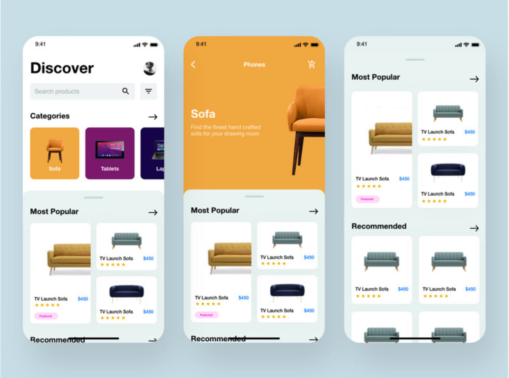
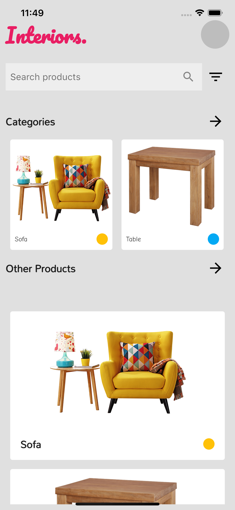
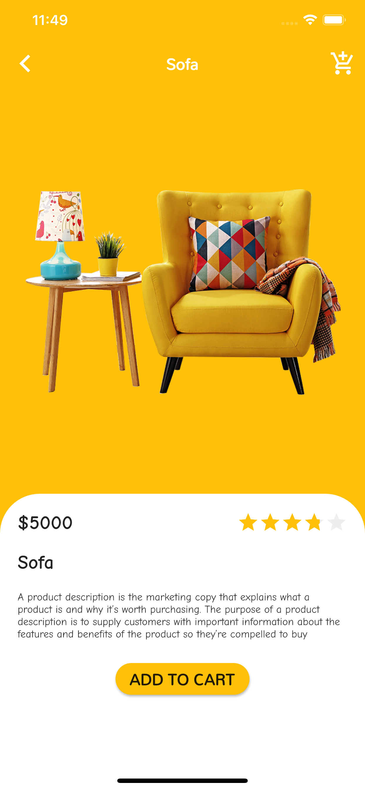
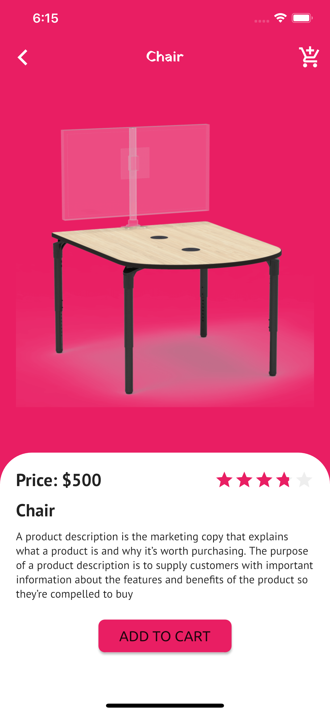
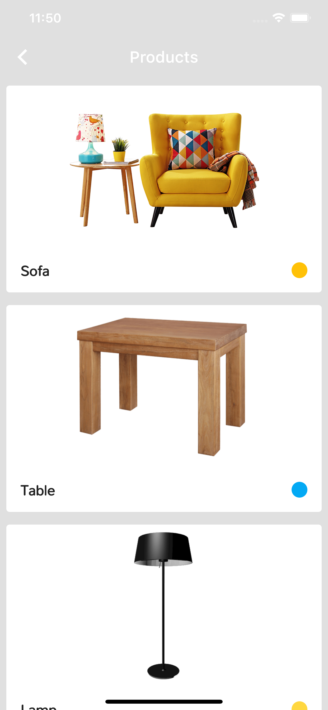
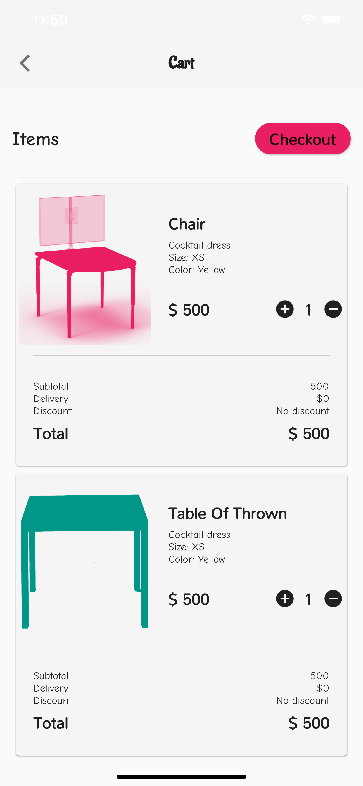
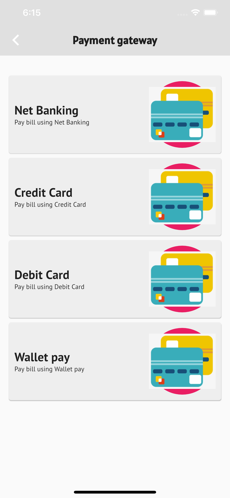

# E-commerce Application

DESCRIPTION
Hi 👋 I recently started with an E-commerce App and decided to share my exploration. I tried to make it sleek and according to latest design trends.

🥇Follow me on Twitter:
https://www.twitter.com/ishailesh18

## ❤ ️Design Taken from:

## Screen Shots

    

  

## API Information (under development)

Need some help? Drop a message to me
<table>
    <tr>
        <td>mshaileshr@gmail.com</td>
    </tr>
</table>

<table>
    <tr>
        <td>Download APK</td>
    </tr>
</table>

[Click To Download](https://github.com/ishaileshmishra/jin_ecomm/blob/master/assets/apk/app-release.apk?raw=true)
